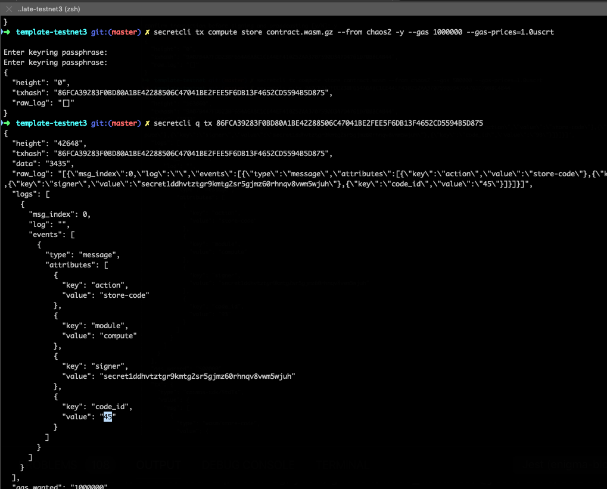
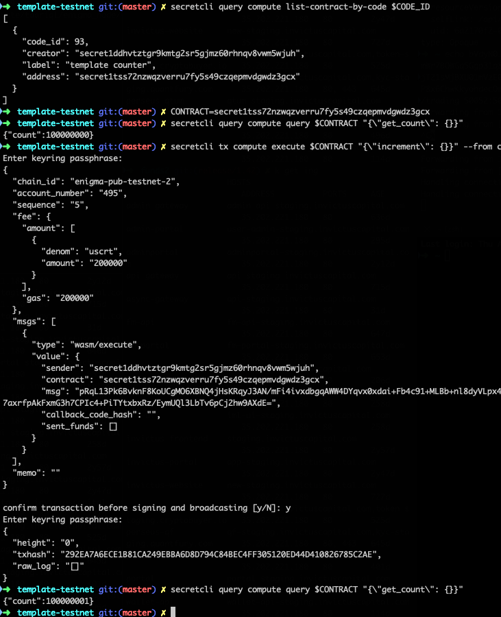

# Secret Network Contracts Introduction

This repository can be used to get up and running on Secret Network testnet (enigma-pub-testnet-2) to start working with secret contracts.

A few important notes:
- smart contracts in this repo are a precursor to Enigma's Secret Contracts, which enable data privacy
- smart contracts are written in Rust and based on cosmwasm, and the module is referred to as `compute` in the Secret Network!
- these cosmwasm-based smart contracts should be reusable and easily modified once we incorporate data privacy

## Setup the Secret Network light client
- [Install the secretcli](https://github.com/enigmampc/SecretNetwork/blob/master/docs/testnet/install_cli.md)
- NB Use v0.8.0 for the testnet (https://github.com/enigmampc/SecretNetwork/releases/tag/v0.8.0)
- configure secretcli to use the testnet
  ```
  secretcli config node tcp://bootstrap.pub.testnet2.enigma.co:26657
  secretcli config chain-id enigma-pub-testnet-3
  ```

## Setup Secret Contracts (cosmwasm)

Secret Contracts are based on [Cosmwasm](https://www.cosmwasm.com) which is an implementation on the Cosmos network. The CosmWasm smart contracts are like Ethereum's smart contracts except they can be used on other blockchains using the [Inter Blockchain Protocol](https://cosmos.network/ibc) (IBC). CosmWasm smart contracts are written in the Rust language.

The SecretNetwork has a _compute_ module that we'll use to store, query and instantiate the smart contract. Once stored on the blockchain the smart contract has to be created (or instantiated) in order to execute its methods. This is similar to doing an Ethereum `migrate` using truffle which handles the deployment and creation of a smart contract.

Eventually the smart contracts will become secret contracts (in a future blockchain upgrade) running in an SGX enclave (Trusted Execution Environment) where computations are performed on the encrypted contract data (i.e. inputs, state).

Next we'll walkthrough steps to:
- install Rust (you can check out the Rust book, rustlings course, examples and more at https://www.rust-lang.org/learn)
- install the Rust dependencies
- create your first project

The Rust dependencies include the Rust compiler, cargo (_package manager_), toolchain and a package to generate projects (you can check out the Rust book, rustlings course, examples and more at https://www.rust-lang.org/learn).


1. Install Rust

More information about installing Rust can be found here: https://www.rust-lang.org/tools/install.

```
curl --proto '=https' --tlsv1.2 -sSf https://sh.rustup.rs | sh
source $HOME/.cargo/env
```

2. Add rustup target wasm32 for both stable and nightly

```
rustup default stable
rustup target list --installed
rustup target add wasm32-unknown-unknown

rustup install nightly
rustup target add wasm32-unknown-unknown --toolchain nightly
```

3. If using linux, install the standard build tools:
```
apt install build-essential
```

4. Run cargo install cargo-generate

Cargo generate is the tool you'll use to create a smart contract project (https://doc.rust-lang.org/cargo).

```
cargo install cargo-generate --features vendored-openssl
```

## Create Initial Smart Contract

To create the smart contract you'll:
- generate the initial project
- compile the smart contract
- run unit tests
- optimize the wasm contract bytecode to prepare for deployment
- deploy the smart contract to your local SecretNetwork
- instantiate it with contract parameters

Generate the smart contract project

```
cargo generate --git https://github.com/enigmampc/secret-template --name mysimplecounter
```

The git project above is a cosmwasm smart contract template that implements a simple counter. The contract is created with a parameter for the initial count and allows subsequent incrementing.

Change directory to the project you created and view the structure and files that were created.

```
cd mysimplecounter
```

The generate creates a directory with the project name and has this structure:

```
Cargo.lock	Developing.md	LICENSE		Publishing.md	examples	schema		tests
Cargo.toml	Importing.md	NOTICE		README.md	rustfmt.toml	src
```

## Compile

Use the following command to compile the smart contract which produces the wasm contract file.

NB The Makefile uses wasm-opt, a WebAssembly optimizer. You can install with npm for eg `npm i -g wasm-opt`

```
make
```

### Store the Smart Contract on our local Testnet

Upload the optimized contract.wasm to _enigma-pub-testnet-3_ :

```
secretcli tx compute store contract.wasm.gz --from <your account alias> -y --gas 1000000 --gas-prices=1.0uscrt
```

The result is a txhash, query it you can see the code_id in the logs, in this case it's 45 as shown below. We'll need the code_id to create an instance of the contract.
```
secretcli q tx 86FCA39283F0BD80A1BE42288506C47041BE2FEE5F6DB13F4652CD5594B5D875
```



### Querying the Smart Contract and Code

List current smart contract code
```
secretcli query compute list-code
[
  {
    "id": 45,
    "creator": "secret1ddhvtztgr9kmtg2sr5gjmz60rhnqv8vwm5wjuh",
    "data_hash": "E15E697E5EB2144C1BF697F1127EDF1C4322004DA7F032209D2D445BCAE46FE0",
    "source": "",
    "builder": ""
  }
]
```

### Instantiate the Smart Contract

To create an instance of this project we must also provide some JSON input data, a starting count, you should change the label to be something unique, which can then be referenced by label instead of contract address for convenience.

```bash
INIT="{\"count\": 100000000}"
CODE_ID=45
secretcli tx compute instantiate $CODE_ID "$INIT" --from <your account alias> --label "my counter" -y
```

With the contract now initialized, we can find its address
```bash
secretcli query compute list-contract-by-code $CODE_ID
```
Our instance is secret1htxt8p8lu0v53ydsdguk9pc0x9gg060k7x4qxr

We can query the contract state
```bash
CONTRACT=secret1htxt8p8lu0v53ydsdguk9pc0x9gg060k7x4qxr

secretcli query compute query $CONTRACT "{\"get_count\": {}}"
```

And we can increment our counter
```bash
secretcli tx compute execute $CONTRACT "{\"increment\": {}}" --from <your account alias>
```


## Smart Contract

### Project Structure

The source directory (`src/`) has these files:
```
contract.rs  lib.rs  msg.rs  state.rs
```

The developer modifies `contract.rs` for contract logic, contract entry points are `init`, `handle` and `query` functions.

`init` in the Counter contract initializes the storage, specifically the current count and the signer/owner of the instance being initialized.

We also define `handle`, a generic handler for all functions writing to storage, the counter can be incremented and reset. These functions are provided the storage and the environment, the latter's used by the `reset` function to compare the signer with the contract owner.

Finally we have `query` for all functions reading state, we only have `query_count`, returning the counter state.

The rest of the contract file is unit tests so you can confidently change the contract logic.

The `state.rs` file defines the State struct, used for storing the contract data, the only information persisted between multiple contract calls.

The `msg.rs` file is where the InitMsg parameters are specified (like a constructor), the types of Query (GetCount) and Handle[r] (Increment) messages, and any custom structs for each query response.

```rs
use schemars::JsonSchema;
use serde::{Deserialize, Serialize};

#[derive(Serialize, Deserialize, Clone, Debug, PartialEq, JsonSchema)]
pub struct InitMsg {
    pub count: i32,
}

#[derive(Serialize, Deserialize, Clone, Debug, PartialEq, JsonSchema)]
#[serde(rename_all = "lowercase")]
pub enum HandleMsg {
    Increment {},
    Reset { count: i32 },
}

#[derive(Serialize, Deserialize, Clone, Debug, PartialEq, JsonSchema)]
#[serde(rename_all = "lowercase")]
pub enum QueryMsg {
    // GetCount returns the current count as a json-encoded number
    GetCount {},
}

// We define a custom struct for each query response
#[derive(Serialize, Deserialize, Clone, Debug, PartialEq, JsonSchema)]
pub struct CountResponse {
    pub count: i32,
}

```

### Unit Tests

Unit tests are coded in the `contract.rs` file itself:

```rs
#[cfg(test)]
mod tests {
    use super::*;
    use cosmwasm::errors::Error;
    use cosmwasm::mock::{dependencies, mock_env};
    use cosmwasm::serde::from_slice;
    use cosmwasm::types::coin;

    #[test]
    fn proper_initialization() {
        let mut deps = dependencies(20);

        let msg = InitMsg { count: 17 };
        let env = mock_env(&deps.api, "creator", &coin("1000", "earth"), &[]);

        // we can just call .unwrap() to assert this was a success
        let res = init(&mut deps, env, msg).unwrap();
        assert_eq!(0, res.messages.len());

        // it worked, let's query the state
        let res = query(&deps, QueryMsg::GetCount {}).unwrap();
        let value: CountResponse = from_slice(&res).unwrap();
        assert_eq!(17, value.count);
    }
```


## Resources
Smart Contracts in the Secret Network use cosmwasm. Therefore, for troubleshooting and additional context, cosmwasm documentation may be very useful. Here are some of the links we relied on in putting together this guide:

- [cosmwasm repo](https://github.com/CosmWasm/cosmwasm)
- [cosmwasm starter pack - project template](https://github.com/CosmWasm/cosmwasm-template)
- [Setting up a local "testnet"](https://www.cosmwasm.com/docs/getting-started/using-the-sdk)
- [cosmwasm docs](https://www.cosmwasm.com/docs/intro/overview) 

# What's next?

- [CosmWasm JS](cosmwasm-js.md)
- [Frontend development](building-a-frontend.md)